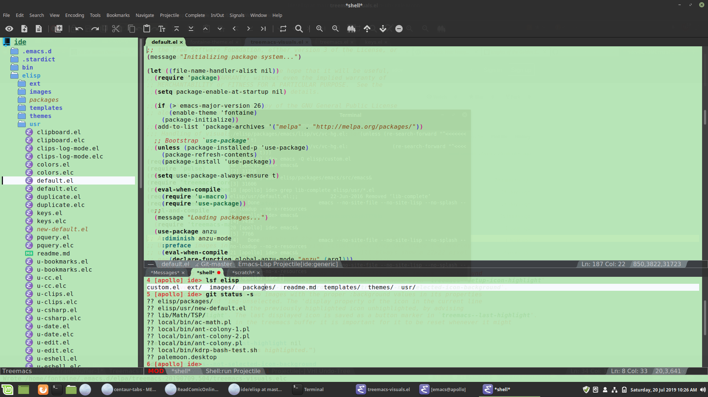

# Emacs-based IDE for non-touch typists

## Inspiration

The inspiration for this IDE came to me after reading Xah Lee's excellent article "Modernization of Emacs (http://ergoemacs.org/emacs/modernization.html). Some of my key take aways were:

#### 1. A major difficulty among programmers who do not use or like Emacs, is that Emacs's user interface is rather esoteric, involving arcane terminologies and keystrokes. This is in sharp contrast to the modern software applications used today, where their User Interface are similar and familiar to computer users.

#### 2. The reason Emacs uses the technical terminologies throughout is because when Emacs started in the 1980s, there has not been the concept of software application, or even other text editors.

#### 3. Emacs's user interface, when compared to modern software application's user interface, is complex and unusual, however, there's no basis whatsoever of it being actually a superior design with regards to any sensible metrics. (in fact, much of Emacs's user interface are due to historical reasons. That is, how computers are in 1970s.)

The larger theme of Xah's article is that the Emacs interface is based on Emacs-isms derived from the programming environment at the MIT AI Laboratory in the late 1970s and early 1980s, and that the Emacs interface should conform to more modern ergonomic standards.

As I'm sure that Xah is aware, there is little hope of that happening. Most Emacs users and developers with an online presence are hard-core touch-typists who are quite content with their Emacs user experience. To suggest the use of mouse, menus, or toolbar is heresy. I have no interest in fighting that battle. I am just grateful that vanilla Emacs contains support for such things.

If you are a devoted keyboard-only user, please avert your eyes, ignore my insane ravings, and continue to enjoy your Emacs experience.

## Design

I am not a UX expert, but I have tried (and continue to try) to create a modern UX programming environment that harnesses the power of Emacs. A non-Emacs user should be able be able to sit down in front of this IDE and not be bewildered. I eschew Emacs terminology as best I can in favor of modern terminology.

### Color

This IDE uses a light theme. While dark themes are currently all the rage, from an ergonomic perspective light themes are better (https://tidbits.com/2019/05/31/the-dark-side-of-dark-mode/). I spend untold hours staring at a computer screen, and I want to go as easy on my eyes as possible.

Colors are chosen from palettes created for Google's Material Design and other UX design sources. Text readability is the primary concern. Syntax highlighting colors are organized to aid in the human coginitive process.

The backgroud color is randomly created, but is limited to a light color that will be easy on the eyes. The color is randomized because I want different Emacs frames or sessions to have different colors. Also, colors display differntly from monitor to monitor. Sometimes, a background color will look good on one monitor on look terrible on another, but a new background color is a control-TAB away.

### Key bindings

I know very few of Emacs standard key sequences (control-x control-c, and the control-h's). I have no interest in learning, nor do I have an interest in developing an RSI. While I'm a big fan of Xah Lee, I do not feel that my touch-typing efficiency is the most important factor of my programming efficiency.

To start I've adopted many common/standard keybindings that non-Emacs users are accustommed to:

* control-a - select all
* control-c - copy
* control-d - duplicate line
* control-e - extend selection
* control-f - search current word
* control-g - goto line
* control-h - search and replace
* control-i - indent selection
* control-k - comment line
* control-o - open file
* control-q - quit (remapped from control-g)
* alt-s     - save file (I couldn't give up isearch)
* control-v - paste
* control-w - close file
* control-x - cut
* control-y - redo
* control-z - undo

Also, *Home*, *End*, *Page Up*, and *Page Down* function as the non-Emacs world expects.

There are many other keybings based on combinations of control, meta, shift and super. As there are too many to remember, I have tried to make organize them in a cognition-friendly manner.

### Menus

Emacs menus suck. I'm sure that are few, if any, people who would disagree. Most users simply disable them altogether. Those who don't disable menus are stuck with the crappy default menus. But why?

Menus are easily reconfigured in elisp. I have reorganized the menus in this IDE to be similar to what is found in other modern IDEs. The menu entries avoid the use of Emacs-isms.

### Toolbar

As with menus, Emacs toolbar sucks. Most users simply disable them altogether. Not only does the functionality suck, but the icons suck as well. Those who don't disable menus are stuck with the crappy default toolbar. Sound familiar?

The icons of my ide use png icons instead of xpm. The icons are based on the Google Material design icon set. Again, I have tried to make organize them in a cognition-friendly manner.

### Tabs

I use the *centaur-tabs* package from *MELPA*.

### Screenshot

